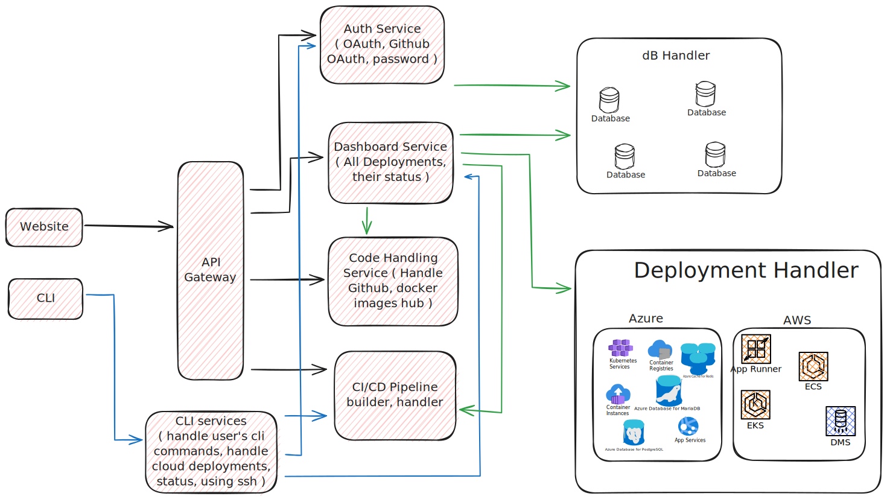

# Decel

Decel is a powerful, open-source alternative to Vercel, offering enhanced functionalities and flexibility for deploying websites with ease.

## Usage

Visit [Dev Docs](/devDocs/Readme.md) for detailed documentation on how to clone and run Decel. Along with that, you can also find the API documentation and CLI documentation.

## Architecture

Decel is built using a microservices architecture. The main components of Decel are:

- **API Gateway**: The API Gateway is the entry point for all requests. It routes requests to the appropriate microservice.
- **Auth Service**: The Auth Service is responsible for handling user authentication and authorization.
- **Deployment Service**: The Deployment Service is responsible for deploying projects.
- **Dashboard Service**: The Dashboard Service is responsible for providing a dashboard for managing deployments.
- **CLI Service**: The CLI Service is responsible for providing a CLI for managing deployments.
- **GitHub Service**: The GitHub Service is responsible for handling GitHub integrations.

> [!NOTE]
> This is for the initial design. The design may change as we progress.
> For Milestone 1

#### Server Design

#### Sequential Workflow

## Technologies

Decel is built using the following technologies:

- **pnpm**: pnpm is used for package management.
- **Nest.js**: Nest.js is used for building the microservices.
- **Docker**: Docker is used for containerization. Also used for building and deploying of projects hosted by us.
- **Kubernetes**: Kubernetes is used for container orchestration. Also used for deploying projects hosted by us.
- **NextJS**: NextJS is used for building the dashboard.
- **Inquirer.js**: Inquirer.js is used for building the CLI.
- **GitHub API**: GitHub API is used for handling GitHub integrations.

## Roadmap

- [ ] **Milestone 1**

  - [ ] Design Architecture
  - [ ] Start by building Docker Compose using Dockerfiles
  - [ ] Deploy Docker Compose files to a server or cloud provider (AWS, GCP, Azure, etc)
  - [ ] Generate Docker Compose files based on user specification and Git repo
  - [ ] Create a dashboard for managing deployments
  - [ ] Add ability to deploy on user's server / instance too
    - [ ] Start with AWS, GCP or Azure (`slowly expand to others`)
    - [ ] Add ability to deploy on user's server too

- [ ] **Milestone 2**

  - [ ] Create a CLI for managing deployments
  - [ ] Add a feature to deploy servers as well
  - [ ] Create GitHub app for auto deployments (generating CI/CD pipelines)

- [ ] **Milestone 3**

  - [ ] Add feature to deploy servers
  - [ ] Host Firebase-like services

- [ ] **Milestone 4**
  - [ ] Add features like custom domains, SSL, etc
  - [ ] Add features like serverless functions, etc
  - [ ] Add features like databases, etc
  - [ ] Add feature like monitoring, etc

## How to Contribute

We welcome contributions! If you have any ideas or improvements, feel free to open an issue or pull request. Please make sure to update tests as appropriate.

## License

Decel is licensed under the MIT License.
